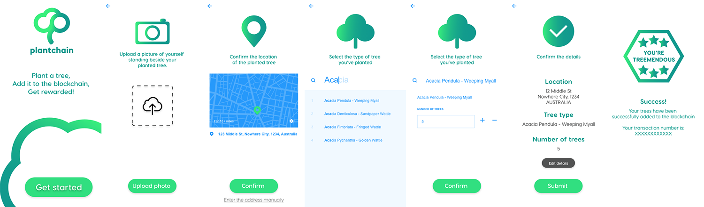

<link href="public/css/style.css" rel="stylesheet"></link>

# 🌳 Plantchain 🌳 Proof of Existence dApp
Plant a tree 🌳, add it to the blockchain ⛓, get rewarded!🎁

# Documents 📄
<a href="">Design Pattern Decisions</a>
<br>
<a href="">Avoiding Common Attacks</a>

# What does this project do? 🤷🏼‍♀️
This project is a Proof of Existence dApp. The dApp provides an interface for people to upload an image via IPFS and input additional information in relation to that image.

# Project use case 👩‍🌾👨‍🌾
The dApp is for people or companies to record their tree planting efforts in order to record the:
- Location of the planted tree/s
- Date/ time
- Type of tree/s planted
- Number of tree/s planted

There is also an element of incentivasation by rewarding participants with <a href="https://en.wikipedia.org/wiki/Carbon_credit"> carbon credits</a>, allowing individuals or companies to lower their carbon footprint.

# User Stories 🙋🏼‍♀️🙋🏾‍♂️📝
1. The user navigates to the plantchain homepage and is prompted to upload an image of them standing beside their planted tree's
2. The user submits the image and the location is pulled from the image EXIF data. The user has the option to confirm the location information propogated or manually input the location of the planted tree.
3. Once the user confirms the location they are able to search a plant database and select the type of tree specie they have planted, and the amount of trees planted.
4. The user is then taken to a summary page where they are asked to confirm or edit the inputted information:
  - Location
  - Type of Tree
  - Amount of trees
5. The user submits their information and is shown a congratulations page with a transaction number

<div class="row">
  
</div>

# Tech Stack 👩‍💻

<div class="row" style="float: right">
  
  
  
  
  
  
  
</div>


# Set up 🔗

Make sure you have ```node``` and ```npm``` installed. ```Yarn``` package manager is recommended but not required. You can install it by running ```brew install yarn```.

Install all dependencies: using ```npm install``` or ```yarn install```.

# testing ✅
```
$ npm test
# or
$ yarn test
```
