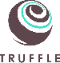

<link href="public/css/style.css" rel="stylesheet"></link>

# Plantchain - Proof of Existence dApp 🌳
Plant a tree, add it to the blockchain, get rewarded!

# Documents
<a href="">Design Patter Decisions</a>
<a href="">Avoiding Common Attacks</a>

# What does this project do?
This project is a Proof of Existence dApp. The dApp provides an interface for people to upload an image via IPFS and input additional information in relation to that image.

# Project use case
The dApp is for people or companies to record their tree planting efforts in order to record the:
- Location of the planted tree/s
- Type of tree/s planted
- Number of tree/s planted

There is also an element of incentivasation by rewarding participants with <a href="https://en.wikipedia.org/wiki/Carbon_credit"> carbon credits</a>, allowing individuals or companies to lower their carbon footprint.

# User Stories

# Tech Stack

# Set up
